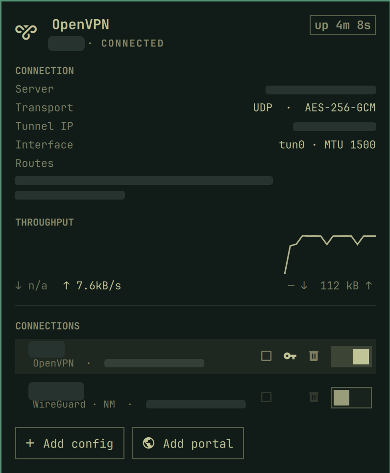

# MultiVPN for Omarchy

One bar widget for every VPN on the machine. **Unified mode** — the default —
lists OpenVPN profiles, OpenVPN 3 configs, WireGuard interfaces and
GlobalProtect portals in a single panel, follows whichever one is connected,
and switches between them with a click. Buttons add a config or a portal
without leaving the panel.

You can also pin an instance to a single backend if you prefer one icon per
VPN; `allowMultiple` is on.

| Backend | Connect / disconnect | Profile list | Autostart | Import | Credentials |
|---|---|---|---|---|---|
| **OpenVPN** (`openvpn-client@`) | yes | `/etc/openvpn/client` | yes | yes | yes |
| **OpenVPN 3** (`openvpn3` D-Bus session manager) | yes | `openvpn3 configs-list` | no | yes | asked at session start — SSO opens the browser |
| **WireGuard** (`wg-quick@` and NetworkManager) | yes | `/etc/wireguard` + `nmcli` | yes | yes | n/a — keys live in the config |
| **GlobalProtect** (`gpclient`) | disconnect yes, connect hands off | no | no | no | n/a — SSO |

Unified mode reports **every** connection that is up, not just one. Split-tunnel
VPNs coexist without trouble — an OpenVPN profile pushing two office subnets and
a WireGuard tunnel routing a few /16s do not interfere at all — so activating one
does not take the others down. When more than one is connected, a selector picks
which one the detail and throughput block describes.

The one real conflict is the default route, and only full-tunnel configs claim
it. If two connections do, the panel says so rather than trying to prevent it.

OpenVPN 3 is the other OpenVPN stack and deliberately a separate backend — the
two coexist on one machine and the panel decides capabilities per row. It is a
per-user D-Bus session manager driven by the unprivileged `openvpn3` CLI, so
listing, importing, connecting and removing configs never touch the root helper
or its cache; polkit governs the D-Bus services instead. A profile with
web-based auth does not just connect: the widget starts the session, opens the
auth URL it prints in your browser, and watches until the session reports
connected. It stops watching after ~120 s but leaves the session standing, so
finishing the login late still connects. Autostart is off for now —
`openvpn3-session@` units want root-owned persistent configs.

GlobalProtect is deliberately the thin one. `gpclient` has no status command,
no systemd unit and an interactive SSO login, so the widget watches it, can take
it down, and hands connecting to a terminal or the vendor GUI. Everything that
comes off the tunnel interface — address, routes, uptime, throughput — works the
same for all three.

*(Deutsche Fassung: [README.de.md](README.de.md).)*



- **Bar icon** — dimmed while down, solid while up, pulsing during a transition.
  Optionally shows the current rate next to the icon.
- **One switch per VPN**, in its own row. There is no global switch: with
  several connections possible at once, a single toggle at the top would have to
  pick one silently.
- **Connection** — server endpoint, protocol and port, cipher, tunnel IP,
  interface and MTU, uptime, pushed routes.
- **Throughput** — a sparkline over the last 60 samples plus current rate and
  session totals, read straight from `/sys/class/net/<iface>/statistics`.
  WireGuard reports both directions. OpenVPN built with **DCO** (interface type
  `ovpn`) never increments the kernel's receive counter — `/proc/net/dev` and
  `ip -s link` agree — so the panel shows the download side as `n/a` and draws
  only the upload curve rather than a flat line that would read as "no traffic".
- **Profiles** — every config the backend knows about with its state, click to
  connect or switch, per-profile autostart, credentials and removal. WireGuard
  lists `wg-quick` units and NetworkManager connections side by side and
  switches each the right way.
- **Import** — pick a file with the dialog or paste a path; the widget works
  out whether it is OpenVPN or WireGuard, suggests a name, and installs it.
  WireGuard configs can go into NetworkManager, which needs neither the root
  helper nor `wireguard-tools`, or into `/etc/wireguard` for `wg-quick`.
  An `.ovpn` file likewise offers a choice once both are possible: into
  OpenVPN 3's session manager (no root helper) or into `/etc/openvpn/client`
  for `openvpn-client@`. GlobalProtect portals are added by host name instead,
  since they are not files.

## Requirements

| Needs | Why |
|---|---|
| one of: `openvpn`, `openvpn3` (openvpn3-linux), `wireguard-tools` (for `wg-quick@`), NetworkManager ≥ 1.16 (for WireGuard connections), `globalprotect-openconnect` | whichever backend you use |
| `bash`, `systemctl`, `ip`, `journalctl`, `cat` | reading status, addresses, routes and the connection log |
| membership in a group that can read the system journal (usually `wheel`) | server endpoint and cipher come from the journal |
| `zenity` | the file dialog for importing a config — optional, the path can also be pasted |
| `pkexec` and `python3` | only for profile management, see below |

Reading the journal is optional in practice: without it the panel simply shows
`—` for server and cipher.

## Install

```bash
omarchy plugin add https://github.com/Nepomuk-Software/MultiVPN.git --enable
```

That is enough — unified mode needs no configuration. To pin an instance to one
backend instead:

```bash
omarchy bar set io.github.nepomuk-software.multivpn backend openvpn
omarchy bar set io.github.nepomuk-software.multivpn profile work
```

## Privilege boundary

**Everything above works with no elevated privileges.** Status, throughput and
connection details come from unprivileged reads. Bringing the tunnel up and down
uses `systemctl start/stop`, which polkit will ask about unless you have a rule
for it (see below).

**Profile management is the exception.** `/etc/openvpn/client` is `750
openvpn:network` and `/etc/wireguard` is root-only, so listing, importing or
removing those configs needs root. NetworkManager-owned WireGuard connections
skip all of this — `nmcli` lists them unprivileged and polkit governs the rest —
and OpenVPN 3 configs skip it the same way through the `openvpn3` CLI. That is
what `system/install.sh` sets up, and it is a deliberate, separate, manual step —
`omarchy plugin add` never runs installers or `sudo`, and this plugin does not
either. Without it the panel stays fully usable and the profile section says so.

The panel offers a **Set up profile management** button for this; it opens a
terminal and runs the script with `sudo`, so you can read what it does before
granting it root. Deliberately not a password dialog: the script sits in a
directory you can write, and running a user-writable script through `pkexec` is
a textbook privilege escalation. Same thing by hand:

```bash
sudo bash ~/.config/omarchy/plugins/io.github.nepomuk-software.multivpn/system/install.sh
```

| Path | What it is |
|---|---|
| `/usr/local/bin/multivpn-admin` | the only thing that writes under `/etc/openvpn/client` and `/etc/wireguard`; `root:root 0755` |
| `/usr/share/polkit-1/actions/software.nepomuk.multivpn.policy` | action `software.nepomuk.multivpn.manage`, `auth_admin_keep` |
| `/etc/systemd/system/multivpn-cache.{path,service}` | regenerates the cache when either config directory changes |
| `/var/lib/multivpn/profiles.json` | the profile list the panel reads; `root:wheel 0640` |

Two things worth knowing about the helper:

- On import it reads the source file **with the calling user's privileges**
  (`setresuid` around the read). Otherwise anyone allowed to run the helper
  could have arbitrary root-owned files copied into `/etc/openvpn/client`.
- The cache holds name, remote, port, protocol, allowed IPs and whether
  credentials exist — never key material or passwords. WireGuard private keys
  are read past, never copied out.

Remove all of it again with:

```bash
sudo bash .../system/install.sh --uninstall
omarchy plugin remove io.github.nepomuk-software.multivpn
```

### Connecting without a password prompt

`systemctl start openvpn-client@<profile>` (and `wg-quick@<name>`) is a
privileged action. To let your
user do it without an auth dialog, add a polkit rule — for example
`/etc/polkit-1/rules.d/49-openvpn-client.rules`:

```javascript
polkit.addRule(function (action, subject) {
  if (action.id == "org.freedesktop.systemd1.manage-units" &&
      (action.lookup("unit").indexOf("openvpn-client@") == 0 ||
       action.lookup("unit").indexOf("wg-quick@") == 0) &&
      subject.isInGroup("wheel")) {
    return polkit.Result.YES;
  }
});
```

Without it, connecting raises the shell's polkit dialog. That works fine too.

## Installing a WireGuard config

Two routes, and the panel offers both under **Add config** once a WireGuard file
is detected:

- **NetworkManager** — no root helper, no `wireguard-tools`, no password prompt.
  The kernel module is all it needs, and NetworkManager activates the connection
  right after importing. Equivalent by hand:
  `nmcli connection import type wireguard file tunnel.conf`
- **wg-quick** — installs into `/etc/wireguard` and is started through
  `wg-quick@<name>.service`. Needs the `wireguard-tools` package for that unit
  to exist, and the root helper to write the directory.

Either way the connection then appears in the list and switches like any other.

## Where things are stored

| Path | What |
|---|---|
| `/var/lib/multivpn/profiles.json` | OpenVPN and `wg-quick` profiles, written by the helper |
| NetworkManager | WireGuard connections, read live via `nmcli` |
| openvpn3 configuration manager | OpenVPN 3 configs, read live via `openvpn3 configs-list` |
| `~/.local/state/multivpn/portals.json` | GlobalProtect portals, owned by you, plain host names |

One known gap: `gpclient` redacts host names in its own log, so when more than
one portal is configured the widget cannot tell which one is connected. It
reports GlobalProtect as connected without marking a row.

## Usage

| Where | Action |
|---|---|
| Bar, left | open/close the panel |
| Bar, right | tunnel on/off |
| Bar, middle | refresh |
| Panel, row switch | connect or disconnect that VPN |
| Panel, click an inactive row | connect it |
| Panel, click an active row | point the detail block at it |
| Panel, `v` | tunnel on/off |
| Panel, `r` | refresh everything |
| Panel, `n` | add a config |
| Panel header | which VPN tooling this machine has, and what is connected |
| Panel, ↑ ↓ / Enter | pick a profile and connect |
| Panel, Esc | close an open form, otherwise the panel |

A keybinding for the tunnel, in `~/.config/hypr/bindings.lua`:

```lua
o.bind("SUPER + ALT + V", "VPN toggle", "omarchy-shell io.github.nepomuk-software.multivpn toggleVpn")
```

## Settings

`omarchy bar set io.github.nepomuk-software.multivpn <key> <value>`

| Key | Default | Effect |
|---|---|---|
| `backend` | `unified` | `unified` for everything at once, or `openvpn` / `openvpn3` / `wireguard` / `globalprotect` to pin one |
| `profile` | *(empty)* | Pinned modes: which profile the icon controls. Unified mode: the favourite that right-click connects when nothing is up |
| `intervalSec` | `5` | status interval while idle |
| `showRate` | `false` | throughput next to the icon in the bar |
| `highlightWhenConnected` | `false` | connected in the accent colour instead of plain |
| `hideWhenDisconnected` | `false` | hide the icon while the tunnel is down |

## IPC

```
omarchy-shell io.github.nepomuk-software.multivpn <method> [profile]
```

| Method | Does |
|---|---|
| `open` `close` `toggle` | the popup |
| `toggleVpn` `connect` `disconnect` | the connection, on the instance that owns the route |
| `toggleVpnFor` `connectFor` `disconnectFor` `statusFor` | same, addressed at a named profile |
| `refresh` | re-read status and profiles |
| `status` | `connected <ip> rx=<bytes> tx=<bytes>`, `connecting`, or the unit state |

## Developing

Changes to the `.qml` files do **not** reach an already-mounted bar instance,
despite `Local plugin changed, reloading` showing up in the log. Run
`omarchy restart shell` after each change.

## License

MIT — see [LICENSE](LICENSE). Plugins run unsandboxed inside the Omarchy shell;
read the code before you install it.
